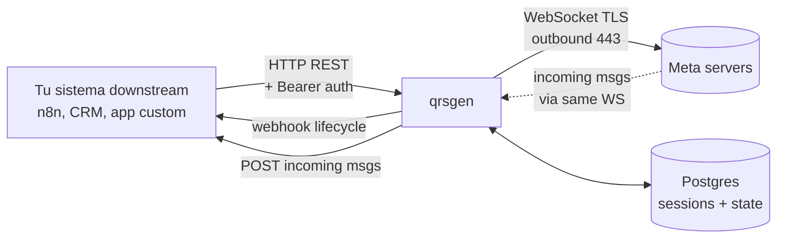

# Arquitectura

## TL;DR

qrsgen es un bridge en Go que mantiene WebSockets contra los servidores de WhatsApp y traduce ese protocolo binario a/desde una API HTTP estándar. Una instancia qrsgen = una sesión WhatsApp = un número. Un solo proceso gestiona N instancias concurrentes.

## ¿Cómo recibe WhatsApp si qrsgen no tiene IP pública?

Pregunta frecuente. Respuesta: el WebSocket TCP se inicia **desde qrsgen hacia Meta** (outbound). Una vez establecido, los mensajes viajan en ambas direcciones por la misma conexión TCP. Es el mismo patrón que el navegador con WhatsApp Web: tu portátil no tiene IP pública y recibe mensajes sin problema porque tu navegador abrió la conexión.

- qrsgen → Meta: SYN saliente, NAT/firewall lo permite
- Meta → qrsgen: respuestas sobre la conexión ya establecida, NAT stateful las permite

→ No requiere DNS, ni puerto abierto desde internet, ni IP pública. Solo egress permitido a 443 hacia rangos Meta.

## Vista 10.000m



## Capas del binario

```
┌──────────────────────────────────────────────────────────────────┐
│  cmd/server/main.go                                              │
│  - Composition root: instancia mgr, dedup, outgoing, sgTracker   │
│  - Echo HTTP server con middlewares (recover, requestID, auth)   │
│  - Mount /metrics (Prometheus) + /api/* (REST) + /static         │
└────────────────┬─────────────────────────────────────────────────┘
                 │
       ┌─────────┼─────────┬──────────────┐
       ▼         ▼         ▼              ▼
  ┌────────┐ ┌────────┐ ┌─────────┐ ┌────────────┐
  │ config │ │notifier│ │ metrics │ │  lib/db    │
  │ (env)  │ │ HTTP   │ │ (prom)  │ │ (pgxpool)  │
  └────────┘ └────┬───┘ └─────────┘ └────────────┘
                  │
                  │
       ┌──────────▼──────────────┐
       │ manager                 │  ← orquestador multi-instancia
       │  - Bootstrap()          │     (carga sessions de DB al arrancar)
       │  - Create/CreateWithOpts│
       │  - onLifecycle (DB+webhook)
       │  - SpamguardConfig/Set  │
       │  - per-instance reconnect flag
       └──────┬──────────────────┘
              │ posee N instancias
              ▼
       ┌──────────────────────────┐
       │ wameow.Conn (×N)         │  ← wrapper de whatsmeow.Client
       │  - WebSocket activo      │
       │  - listenQR(qrChan)      │
       │  - handle(events)        │
       │  - emit lifecycle events │
       │  - SendText / SendMedia  │
       └──────┬───────────────────┘
              │ eventos in/out
              ▼
       ┌──────────────────────────┐
       │ bridge                   │  ← protocol translator
       │  - incoming.go           │     WhatsApp event → HTTP POST downstream
       │  - outgoing.go           │     webhook recibido → SendText
       │  - dedup.go              │     LID-twin + spamguard tracker
       └──────────────────────────┘
```

## Bootstrap

Al arrancar, `main.go` ejecuta:

1. `config.Load()` parsea env vars (postgres, downstream URL, tokens).
2. `pgxpool` conecta a Postgres.
3. `manager.New()` instancia el container whatsmeow apuntando al mismo Postgres (whatsmeow guarda sus tablas `whatsmeow_*` allí).
4. `manager.EnsureSchema()` aplica migraciones idempotentes sobre `bridge_instance`.
5. `manager.Bootstrap()`:
   - Lee `SELECT name, jid FROM bridge_instance`
   - Marca ventana de bootstrap (15 segundos) → suprime webhooks `connected`
   - Para cada fila: crea `wameow.Conn`, whatsmeow carga sesión por JID, abre WebSocket, emite `paired` + `connected`
6. Tras 8 segundos, dispara `backend_started` por instancia.
7. Echo HTTP server arranca en `:3100`.

## Persistencia

**DB Postgres (`bridge`):**

```
bridge_instance              -- config + state machine timestamps
├── name (PK)
├── jid                      -- WhatsApp JID (NULL hasta pareado)
├── paired_at, ready_at,     -- timestamps de lifecycle
├── last_event_at
├── inbox_id                 -- ID arbitrario para routing downstream
├── events_webhook_url       -- URL donde POSTear lifecycle events
├── spamguard_enabled
└── last_qr_msg_id           -- ID del último msg posteado con QR (opcional)

bridge_dedup                 -- LID-twin dedup + idempotencia
├── instance_name, remote_jid, content_hash (composite)
└── seen_at

whatsmeow_*                  -- tablas internas de whatsmeow (sessions, keys, etc.)
```

**State in-memory (Go):**

- `SpamguardTracker` — historial last-2 mensajes por (instance, jid_user) + counter de bloqueos por instancia. Se pierde en restarts (semántica: solo evita duplicados back-to-back dentro de una sesión).
- `disconnectNotified[instance]` — flag para convertir el siguiente `connected` en `reconnected` tras un `unreachable` ya notificado.

## Flujo INCOMING (cliente WhatsApp → tu sistema)

```
Cliente WhatsApp envía msg al número conectado
        │
        ▼
Meta servers enrutan al WebSocket activo del JID destino
        │
        ▼
WebSocket que qrsgen mantiene abierto desde bootstrap
        │ whatsmeow emite events.Message
        ▼
wameow.handle() switch case → onMessage callback
        │
        ▼
bridge/incoming.go:
        │ resuelve LID↔PN si aplica (Multi-Device)
        │ si fromMe=true: dedup.ShouldDrop() para evitar twin
        │ construye payload {content, attachments, source_id: WAID:..., conversation, ...}
        │ POST al endpoint downstream (configurable por env DOWNSTREAM_BASE_URL,
        │   pero el HTTP cliente es genérico — sirve cualquier endpoint
        │   que acepte el formato Channel::Api-compatible)
        ▼
Tu sistema recibe el POST y hace lo que necesite (persistir, notificar, etc.)
```

metric: `qrsgen_messages_total{direction="in",instance}++`

## Flujo OUTGOING (tu sistema → cliente WhatsApp)

```
Tu sistema decide enviar un msg al cliente
        │
        ▼
POST http://qrsgen:3100/api/instances/<INSTANCE_NAME>/webhook
   Content-Type: application/json
   Body: {
     "event": "message_created",
     "message_type": "outgoing",
     "content": "Hola...",
     "attachments": [...],
     "conversation": { "id": ..., "meta": { "sender": { "identifier": "<JID>" }}},
     "id": 12345,                         // tu id de mensaje (idempotencia)
     "private": false                     // si true → ignorado, no se envía a WhatsApp
   }
        │
        ▼
bridge/outgoing.go HandleFor():
        │ early returns:
        │   - skip si message_type != "outgoing"
        │   - skip si private=true
        │   - skip si source_id startswith "WAID:" (eco)
        │   - skip si remoteJid startswith "qrsgen-qr-" (synthetic ops contact)
        │ dedup por msg_id (idempotencia ante retry)
        │ spamguard: tracker.CheckAndRecord(instance, jid, content)
        │   - si blocked: emit "spam_blocked" event + return
        │ ▼
        │ sender.SendText / SendMedia → whatsmeow → WebSocket → Meta
        │ ▼
        │ PATCH del msg downstream con source_id="WAID:..." para evitar re-procesar el eco
        ▼
Cliente WhatsApp recibe el msg
```

metric: `qrsgen_messages_total{direction="out",instance}++`

## Eventos de ciclo de vida

`wameow.Conn` dispara eventos hacia `manager.onLifecycle`:

```
events.PairSuccess         → EventPaired
events.Connected           → EventConnected
events.Disconnected        → EventDisconnected (disparará Unreachable inmediato + Disconnected con grace 2min)
events.LoggedOut           → EventLoggedOut
events.TemporaryBan        → EventStrike
events.ConnectFailure 4xx  → EventStrike
listenQR(qrChan) "code"    → EventQRGenerated
```

`manager.onLifecycle`:

1. Persiste en DB (UPDATE `bridge_instance`).
2. Decide qué webhook emitir:
   - `EventDisconnected` → goroutine: emit `unreachable` immediately + emit `disconnected` after 2min grace (cancelado si reconecta antes).
   - `EventConnected` → si `disconnectNotified[name]==true` → emite `reconnected`; durante bootstrap window suprime el webhook.
3. POST al `events_webhook_url` con payload `{instance, event, jid, occurred_at, [extras]}`.
4. metric: `qrsgen_lifecycle_events_total{instance,event}++`

Eventos custom (no provienen directamente de whatsmeow):

- `spam_blocked` — emitido desde `outgoing.HandleFor` con `{count, preview}`.
- `backend_restarting` — emitido por `BroadcastBackendRestarting()` al SIGTERM.
- `backend_started` — emitido por `BroadcastBackendStarted()` tras 8s post-bootstrap.

## Concurrencia

- 1 goroutine por instancia dentro de whatsmeow para su WebSocket.
- `manager.mu sync.RWMutex` protege el map `instances`.
- `manager.reconMu` protege el map `disconnectNotified`.
- `SpamguardTracker.mu` protege `history` + `counter`.
- `Deduper` usa pgxpool (thread-safe nativo).
- Lifecycle webhooks salen en goroutines independientes.
- Graceful shutdown: `signal.NotifyContext(SIGTERM)` → `BroadcastBackendRestarting()` → `time.Sleep(12s)` → `e.Shutdown(ctx)` → `mgr.Shutdown()` cierra todas las Conn.

## Multi-instancia routing

Cuando llega un msg incoming:

1. whatsmeow sabe la instancia.
2. `mgr.InboxIDFor("whatsapp-main")` → query DB → `inbox_id=N` (arbitrario, lo defines tú).
3. POST al endpoint downstream con ese inbox_id en el payload.

Cuando llega outgoing:

1. URL del webhook contiene `/api/instances/whatsapp-main/webhook` → instancia parseada.
2. `mgr.Get("whatsapp-main")` → `Conn` → `SendText`.

→ Multi-instancia funciona en el mismo proceso qrsgen, cada una con su WebSocket independiente.

## Limitaciones conocidas

- **Multi-tenant no real**: `DOWNSTREAM_BASE_URL` y tokens son únicos por proceso. Para soportar varios downstreams desde un solo qrsgen habría que pasar el tenant junto con `instance_name`.
- **Spamguard counter in-memory**: se pierde en cada deploy.
- **LID twin del cliente**: el dedup limpia lo que sincronizamos downstream, pero el destinatario sigue recibiendo 2 mensajes si WhatsApp ya hizo dispatch dual. Esto se resolvería migrando a Cloud API oficial.
