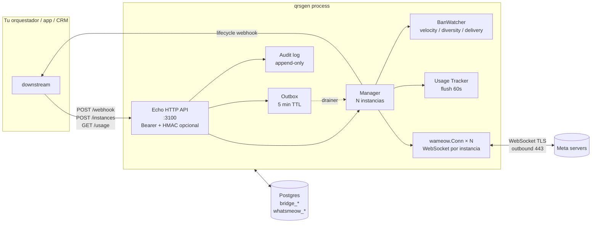

# Arquitectura

## TL;DR

qrsgen es un bridge en Go que mantiene WebSockets contra los servidores de
WhatsApp y traduce ese protocolo binario a/desde una API HTTP REST. Una
**instancia qrsgen = una sesión WhatsApp = un número**. Un solo proceso
gestiona N instancias concurrentes en goroutines independientes.

Diseñado para:
- Vivir en una **overlay LAN** detrás de cualquier orquestador (n8n, una
  app custom, un CRM, etc.). Sin DNS público.
- **Reanudarse sin pérdida** durante restarts cortos (≤5 min) gracias al
  outbox persistido.
- **Detección proactiva de ban risk** (velocity, diversity, delivery ratio).
- **Multi-tenant ligero** vía `owner_tag` libre + agregado de usage por mes.
- **Audit log inmutable** con triggers que rechazan UPDATE/DELETE.

## ¿Cómo recibe WhatsApp si qrsgen no tiene IP pública?

Pregunta frecuente. Respuesta: el WebSocket TCP se inicia **desde qrsgen
hacia Meta** (outbound). Una vez establecido, los mensajes viajan en ambas
direcciones por la misma conexión TCP. Es el mismo patrón que el navegador
con WhatsApp Web: tu portátil no tiene IP pública y recibe mensajes sin
problema porque tu navegador abrió la conexión.

- qrsgen → Meta: SYN saliente, NAT/firewall lo permite.
- Meta → qrsgen: respuestas sobre la conexión ya establecida, NAT stateful
  las permite.

→ No requiere DNS público, ni puerto abierto desde internet, ni IP pública.
Solo egress permitido al :443 hacia rangos Meta (mantenidos en
`firewall.sh` como allowlist iptables).

## Vista 10.000m



## Capas del binario

```
┌─────────────────────────────────────────────────────────────────────┐
│  cmd/server/main.go                                                 │
│  - Composition root: cablea manager, outbox, banwatch, usage, audit │
│  - Echo HTTP server con middleware Bearer + HMAC + RequestID        │
│  - /api/health, /api/instances/*, /api/usage, /api/audit, /metrics  │
└──────┬──────────────────────────────────────────────────────────────┘
       │
   ┌───┼───────────┬────────────┬────────────┬─────────────┬─────────┐
   ▼   ▼           ▼            ▼            ▼             ▼         ▼
 config bridge   manager     outbox       banwatch       usage    audit
 (env)  in/out   N instances queue 5min   velocity etc   daily    immut
                              + drainer    + endpoint     + flush  triggers
   │                │             │            │             │       │
   └────────────────┴─────────────┴────────────┴─────────────┴───────┘
                                  │
                                  ▼
                       wameow.Conn × N — WebSocket por instancia
                                  │
                                  ▼
                       Postgres (bridge_* + whatsmeow_*)
```

## Bootstrap

`main.go` al arrancar:

1. `config.Load()` parsea env vars.
2. `pgxpool` conecta a Postgres.
3. `lib.EnsureBridgeSchema` + `usage.EnsureSchema` + `audit.EnsureSchema` +
   `outbox.EnsureSchema` + `manager.EnsureSchema` aplican migraciones
   idempotentes.
4. `manager.New()` crea el container whatsmeow apuntando al mismo Postgres
   (whatsmeow gestiona sus tablas `whatsmeow_*` allí).
5. `usage.Tracker` arranca su goroutine de flush cada 60s.
6. `audit.Logger` registra `backend.boot`.
7. `manager.Bootstrap()`:
   - `SELECT name, jid FROM bridge_instance`.
   - Marca ventana de bootstrap (15s) → suprime webhooks `connected` de la
     avalancha de reconexiones.
   - Para cada fila: crea `wameow.Conn`, whatsmeow carga la sesión por
     JID, abre WebSocket, emite `paired` + `connected`.
8. `banwatch.Start()` arranca el evaluator cada 30s.
9. `outbox.Start()` arranca drainer (5s) + expirer (30s).
10. Tras 8s, `BroadcastBackendStarted()` emite `backend_started` por
    instancia.
11. Echo HTTP server arranca en `:3100`.

## Persistencia

### Postgres (DB `bridge`)

```
bridge_instance              -- config + state machine timestamps
├── name (PK)
├── jid                      -- WhatsApp JID (NULL hasta pareado)
├── paired_at, ready_at, last_event_at
├── inbox_id                 -- arbitrario, lo decide el integrador
├── events_webhook_url       -- POST destino de lifecycle events
├── spamguard_enabled, spamguard_window_ms, spamguard_min_chars
├── last_qr_msg_id
└── owner_tag                -- string libre para correlación tenant→instancia

bridge_dedup                 -- idempotencia incoming + LID-twin
├── instance_name, remote_jid, content_hash (composite PK)
└── seen_at

bridge_usage_daily           -- counters diarios por instancia
├── instance, day (PK)
├── messages_in, messages_out
├── spamguard_blocks, lifecycle_events
└── updated_at

bridge_outgoing_queue        -- outbox persistido para reconnect
├── id (BIGSERIAL PK)
├── instance, remote_jid
├── payload (JSONB)          -- WebhookPayload completo
├── enqueued_at, expires_at  -- TTL default 5 min
├── attempts, last_error
├── status                   -- pending | sent | expired | failed
└── sent_at

bridge_audit_log             -- append-only, triggers rechazan UPDATE/DELETE
├── id (BIGSERIAL PK)
├── ts, actor, action
├── instance, target
└── metadata (JSONB)

whatsmeow_*                  -- internas de whatsmeow (sessions, keys, etc.)
```

### State in-memory (Go)

| Estructura | Granularidad | Persiste en restart |
|---|---|---|
| `SpamguardTracker` last-2 history + block counter | (instance, jid_user) | no |
| `manager.disconnectNotified` | instance | no |
| `manager.pendingReconnected` | instance | no |
| `manager.pendingUnreachable` | instance | no |
| `banwatch` ring buffer de eventos send | instance | no |
| `usage.Tracker` deltas no-flushed | (instance, day) | no (DB se actualiza c/60s) |

Todo el state in-memory es transitorio por diseño — los efectos importantes
(usage counters, audit log, outbox payloads, spamguard config) viven en
Postgres y sobreviven restarts.

## Flujo INCOMING (cliente WhatsApp → tu sistema)

```
Cliente WhatsApp envía msg al número conectado
        │
        ▼
Meta enruta al WebSocket activo del JID destino
        │
        ▼
WebSocket que qrsgen mantiene abierto desde bootstrap
        │ whatsmeow emite events.Message
        ▼
wameow.handle() → callback onMessage
        │
        ▼
bridge/incoming.go:
        │ resuelve LID↔PN si aplica (Multi-Device)
        │ si fromMe=true: dedup.ShouldDrop() para evitar twin
        │ construye payload {content, attachments, source_id: WAID:..., ...}
        │ POST al endpoint downstream
        ▼
Tu sistema recibe el POST y procesa
        │
        └─ usage.IncIn(instance)
        └─ metric qrsgen_messages_total{direction="in"}++
```

## Flujo OUTGOING (tu sistema → cliente WhatsApp)

```
Tu sistema decide enviar un msg al cliente
        │
        ▼
POST http://qrsgen:3100/api/instances/<INSTANCE_NAME>/webhook
   Headers: Content-Type: application/json
            X-Qrsgen-Signature: sha256=<hex>   (opcional, si WEBHOOK_HMAC_SECRET set)
   Body: {
     "event": "message_created",
     "message_type": "outgoing",
     "content": "Hola...",
     "attachments": [...],
     "conversation": { "id": ..., "meta": { "sender": { "identifier": "<JID>" }}},
     "id": 12345,                         // tu id de mensaje (idempotencia)
     "private": false
   }
        │
        ▼
api.POST("/instances/:name/webhook"):
        │ leer raw body
        │ HMAC middleware (si secret configurado)
        │ ¿mgr.IsConnected(instance)?
        │
        │     SI            NO
        │     │              │
        │     ▼              ▼
        │  HandleFor    outbox.Enqueue → 202 {status:"queued", queue_id, expires_at}
        │     │
        │     ▼
        │  bridge/outgoing.go HandleFor():
        │    - skip si message_type != "outgoing"
        │    - skip si private=true
        │    - skip si source_id startswith "WAID:" (eco)
        │    - skip si remoteJid startswith "qrsgen-qr-" (ops contact)
        │    - dedup por msg_id
        │    - spamguard.CheckAndRecord → si dup: emit "spam_blocked"
        │    - banwatch.Record(success|failure)
        │    - sender.SendText/SendMedia → whatsmeow → Meta
        │    - PATCH source_id="WAID:..." en downstream
        │     │
        │     ▼
        │  200 {status:"sent"}
        ▼
Cliente WhatsApp recibe el msg
```

`outbox.drainer` (cada 5s) retoma los queued cuando la instancia vuelve a
`IsConnected()`. Si no entrega antes de `expires_at` (TTL 5 min default),
`outbox.expirer` (cada 30s) marca la fila `expired` y emite el lifecycle
event `outgoing_expired` con un preview del contenido — el integrador
decide qué hacer (notificar al agente, re-postear, archivar).

## Detección de ban-risk

`internal/banwatch` mantiene un ring buffer por instancia con los últimos
~10 minutos de eventos `(timestamp, jid, success)`. Tres señales:

| Señal | Default threshold | Por qué importa |
|---|---|---|
| **velocity** | >30 msgs / 1 min | Patrón típico de blast spam |
| **diversity** | >20 JIDs únicos / 5 min | Outreach masivo a nuevos contactos |
| **delivery_ratio** | <0.7 sobre 10 samples / 10 min | WhatsApp rechaza envíos → near-ban |

Cuando una señal cruza su threshold, el watcher emite el evento lifecycle
`ban_risk` **una vez** (rising edge). Vuelve a emitir si la alerta se
limpia y dispara de nuevo. `GET /api/instances/:name/ban-risk` devuelve
el snapshot completo + un score 0-1 y un level cualitativo.

Pensado para que tu orquestador reduzca el ritmo / pause envíos antes de
que WhatsApp tome medidas (strike/ban).

## Usage tracking + monetización

`internal/usage` incrementa contadores in-memory en cada send/receive y
flush-ea a `bridge_usage_daily` cada 60s con UPSERT. Si Postgres está
temporalmente caído, los deltas se preservan para el siguiente tick.

- `GET /api/instances/:name/usage` — días para una instancia.
- `GET /api/usage` — días para todas (dashboard).
- `GET /api/usage/summary` — agregado mensual por `(owner_tag, mes)`. Esta
  es la query típica de billing: el integrador mapea `owner_tag` a su
  tenant y suma los counters que tarifique.

qrsgen NO toma decisiones de pricing — solo expone los hechos.

## Audit log inmutable

`internal/audit` escribe en `bridge_audit_log` cada operación
relevante: `instance.create / patch / delete`, `outbox.enqueue / expire /
failed`, `backend.boot`. La tabla tiene dos triggers en plpgsql:

```sql
BEFORE UPDATE → RAISE 'append-only'
BEFORE DELETE → RAISE 'append-only'
```

Una app comprometida no puede reescribir el log sin privilegios DBA.
`GET /api/audit?instance=&limit=` lo lista para compliance/forensics.

## Eventos de ciclo de vida

`wameow.Conn` dispara hacia `manager.onLifecycle`:

```
events.PairSuccess         → EventPaired
events.Connected           → EventConnected
events.Disconnected        → EventDisconnected (con grace 60s para evitar pills de blips)
events.LoggedOut           → EventLoggedOut
events.TemporaryBan        → EventStrike
events.ConnectFailure 4xx  → EventStrike
listenQR(qrChan) "code"    → EventQRGenerated
```

`manager.onLifecycle`:

1. UPDATE `bridge_instance` (timestamps + JID si aplica).
2. Decide qué webhook emitir, con grace/stabilize:
   - `EventDisconnected` → silencio 60s; si vuelve antes, blip silencioso;
     si no, emite `unreachable`.
   - `EventConnected` tras `unreachable` previo → espera 5s de estabilidad
     y emite `reconnected` (NO durante bootstrap window).
3. POST al `events_webhook_url` con `{instance, event, jid, occurred_at, ...}`.
4. `metrics.LifecycleEvents` + `usage.IncLifecycle`.

Eventos custom (no provienen de whatsmeow):

- `spam_blocked` — emitido desde `outgoing.HandleFor` con `{count, preview}`.
- `backend_restarting` — emitido por `BroadcastBackendRestarting()` al SIGTERM.
- `backend_started` — emitido por `BroadcastBackendStarted()` tras 8s post-bootstrap.
- `ban_risk` — emitido por `banwatch.evaluate` cuando un threshold cruza.
- `outgoing_expired` — emitido por `outbox.expirer` cuando un mensaje
  expira sin entregarse.

## Concurrencia

- **1 goroutine por instancia** dentro de whatsmeow para su WebSocket.
- **manager.mu** (`sync.RWMutex`) protege `instances`, `reconMu` y
  `unreachMu` protegen flags lifecycle.
- **SpamguardTracker.mu** protege historial + counter.
- **banwatch.mu** protege los buckets.
- **usage.mu** protege los buckets pendientes de flush.
- **outbox.mu** serializa el drainer (DB transactions).
- **Deduper** usa pgxpool (thread-safe nativo).
- **Lifecycle webhooks** salen en goroutines independientes.
- **Graceful shutdown**: `signal.NotifyContext(SIGTERM)`
  → `BroadcastBackendRestarting()` → `sleep 12s` (el downstream drena
  webhooks pendientes) → `e.Shutdown(ctx)` → `mgr.Shutdown()` cierra todas
  las Conn y `usage.Tracker` flushea por última vez antes de salir.

## Multi-instance routing

Cuando llega un msg incoming:

1. whatsmeow sabe la instancia.
2. `mgr.InboxIDFor("whatsapp-main")` → query DB → `inbox_id=N`.
3. POST al downstream con ese inbox_id en el payload.

Cuando llega outgoing:

1. URL del webhook contiene `/api/instances/whatsapp-main/webhook` →
   instancia parseada.
2. Si `IsConnected(whatsapp-main)` → `Conn.SendText`. Si no → outbox.

→ Multi-instance funciona en el mismo proceso qrsgen, cada una con su
WebSocket independiente, su tracker spamguard separado y su buffer de
banwatch propio.

## Limitaciones conocidas

- **Único downstream por proceso**: `DOWNSTREAM_BASE_URL` y `DOWNSTREAM_API_TOKEN`
  son globales. Para servir varios downstream distintos desde un solo
  qrsgen habría que enrutar por `owner_tag` y mantener un mapa de clientes
  HTTP. Workaround actual: un proceso qrsgen por downstream, todos
  apuntando al mismo Postgres (separan namespaces por nombres de instancia).
- **LID twin del cliente**: el dedup limpia lo que sincronizamos
  downstream, pero el destinatario sigue recibiendo 2 mensajes si WhatsApp
  ya hizo dispatch dual. Se resolvería migrando a Cloud API oficial.
- **Outbox sin cifrado en disco**: los payloads de WhatsApp viven en
  `bridge_outgoing_queue` durante hasta 5 min. Si comprometen el Postgres,
  los mensajes en cola son legibles. En multi-tenant serio se debería
  cifrar el payload por tenant.
- **BanWatcher per-process**: no comparte estado entre réplicas (qrsgen
  corre con `replicas: 1` por diseño — una sesión WhatsApp por proceso —
  así que esto no es un problema en producción típica).
