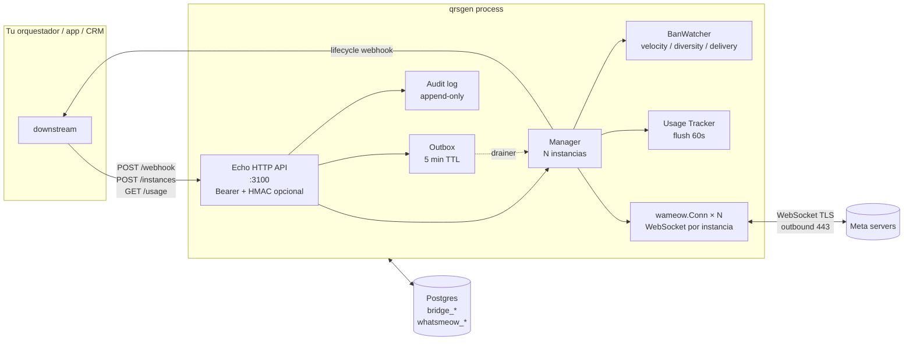

# Arquitectura — Visión general

## TL;DR

qrsgen es un bridge en Go que mantiene WebSockets contra los servidores
de WhatsApp y traduce ese protocolo binario a/desde una API HTTP REST.
Una **instancia qrsgen = una sesión WhatsApp = un número**. Un solo
proceso gestiona N instancias concurrentes en goroutines independientes.

Diseñado para:

- Vivir en una **overlay LAN** detrás de cualquier orquestador (n8n, una
  app custom, un CRM, etc.). Sin DNS público.
- **Reanudarse sin pérdida** durante restarts cortos (≤5 min) gracias al
  outbox persistido.
- **Detección proactiva de ban risk** (velocity, diversity, delivery ratio).
- **Multi-tenant ligero** vía `owner_tag` libre + agregado de usage por mes.
- **Audit log inmutable** con triggers que rechazan UPDATE/DELETE.

## ¿Cómo recibe WhatsApp si qrsgen no tiene IP pública?

Pregunta frecuente. Respuesta: el WebSocket TCP se inicia **desde qrsgen
hacia Meta** (outbound). Una vez establecido, los mensajes viajan en
ambas direcciones por la misma conexión TCP. Es el mismo patrón que el
navegador con WhatsApp Web: tu portátil no tiene IP pública y recibe
mensajes sin problema porque tu navegador abrió la conexión.

- qrsgen → Meta: SYN saliente, NAT/firewall lo permite.
- Meta → qrsgen: respuestas sobre la conexión ya establecida, NAT
  stateful las permite.

→ No requiere DNS público, ni puerto abierto desde internet, ni IP
pública. Solo egress permitido al :443 hacia rangos Meta (mantenidos en
`firewall.sh` como allowlist iptables).

## Vista 10.000m



## Capas del binario

```
┌─────────────────────────────────────────────────────────────────────┐
│  cmd/server/main.go                                                 │
│  - Composition root: cablea manager, outbox, banwatch, usage, audit │
│  - Echo HTTP server con middleware Bearer + HMAC + RequestID        │
│  - /api/health, /api/instances/*, /api/usage, /api/audit, /metrics  │
└──────┬──────────────────────────────────────────────────────────────┘
       │
   ┌───┼───────────┬────────────┬────────────┬─────────────┬─────────┐
   ▼   ▼           ▼            ▼            ▼             ▼         ▼
 config bridge   manager     outbox       banwatch       usage    audit
 (env)  in/out   N instances queue 5min   velocity etc   daily    immut
                              + drainer    + endpoint     + flush  triggers
   │                │             │            │             │       │
   └────────────────┴─────────────┴────────────┴─────────────┴───────┘
                                  │
                                  ▼
                       wameow.Conn × N — WebSocket por instancia
                                  │
                                  ▼
                       Postgres (bridge_* + whatsmeow_*)
```

## Navegación

- [Bootstrap](bootstrap.md) — qué ocurre al arrancar `main.go`.
- [Persistencia](persistence.md) — tablas Postgres + state in-memory.
- [Flujo INCOMING](incoming-flow.md) — cliente WhatsApp → tu sistema.
- [Flujo OUTGOING](outgoing-flow.md) — tu sistema → cliente WhatsApp + outbox.
- [BanWatcher](banwatch.md) — detector de ban-risk con 3 señales.
- [Usage tracking](usage-tracking.md) — counters + monetización.
- [Audit log](audit-log.md) — append-only con triggers DB.
- [Lifecycle events](lifecycle-events.md) — qué eventos emite y cuándo.
- [Concurrencia](concurrency.md) — mutexes + goroutines + shutdown.
- [Multi-instance routing](multi-instance.md) — cómo se enruta por nombre.
- [Limitaciones conocidas](limitations.md) — lo que aún no es robusto.
